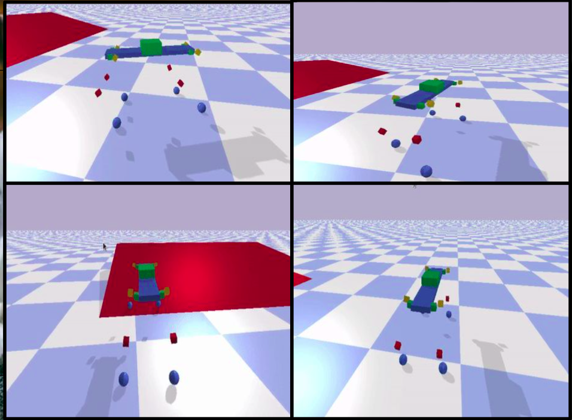

# Robot_dog
Includes a python code to model the walking gaits of a robotic  dog as well as its climbing up the hill on pybullet simulator.

# Demo

# Steps to run the code
1. git clone the repo 
2. Install python
3. pip install pybullet
4. python robotdog.py
